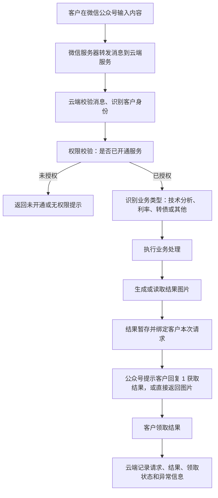
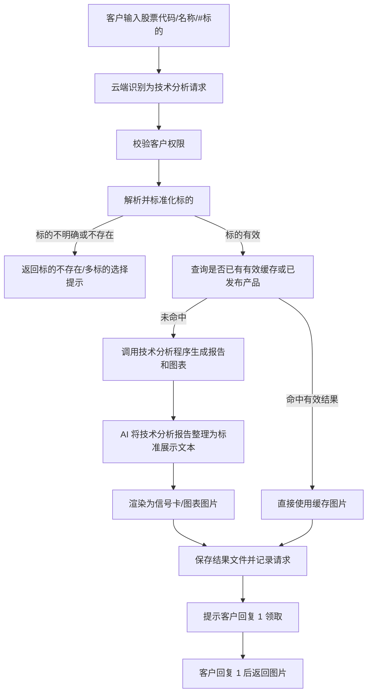
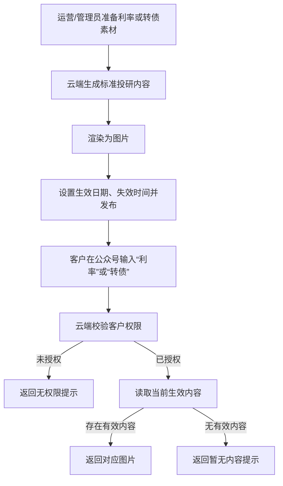

# 公众号投研服务业务流程说明

本文用于与合规沟通公众号端投研服务的业务模式，重点说明客户从微信公众号输入需求，到云端系统处理，再返回结果的完整流程。本文不展开底层代码细节，仅保留必要的技术说明，便于非技术人员理解。

## 一、业务范围

当前公众号端主要涉及以下投研服务：

| 服务类型 | 客户触发方式 | 内容生成方式 | 返回形式 |
| --- | --- | --- | --- |
| 技术分析 | 输入股票代码、股票名称，或输入“#标的” | 云端按客户请求实时生成；若已有有效缓存，则直接复用缓存结果 | 技术分析信号卡、技术指标图表等图片 |
| 利率 | 输入或点击“利率” | 后台先生成、审核/发布为当前生效内容，客户触发后直接返回 | 当前生效的利率投研图片 |
| 转债 | 输入或点击“转债” | 后台先生成、审核/发布为当前生效内容，客户触发后直接返回 | 当前生效的可转债投研图片 |

## 二、总体链路

## 三、客户输入到云端的流程

1. 客户在公众号内发送文本，例如股票代码、股票名称、“#300502.SZ”、“利率”或“转债”。
2. 微信公众平台服务器将该消息转发到云端服务配置的公众号接口。
3. 云端服务解析微信消息，获取客户的公众号 openid、消息内容、消息编号等必要信息。
4. 云端先进行客户权限校验：
   - 未开通服务或权限不匹配时，不进入内容生成流程，直接返回“暂未开通/无权限”等提示。
   - 已开通服务时，继续进入业务识别和处理。
5. 云端根据客户输入判断业务类型：
   - 输入“利率”时，进入利率内容领取流程。
   - 输入“转债”时，进入可转债内容领取流程。
   - 输入股票代码、股票名称或“#标的”时，进入技术分析流程。
   - 无法识别时，返回规范化输入提示。

## 四、技术分析业务流程

技术分析属于“客户按需触发”的实时服务，系统会根据客户输入的具体标的生成或读取技术分析结果。

关键说明：

- 客户输入的股票代码或名称会先做标准化处理，避免同名、错码或多标的误匹配。
- 系统优先复用仍然有效的缓存结果，减少重复生成，确保同一版本、同一交易日的结果一致。
- 若没有有效缓存，云端会执行技术分析程序，生成原始技术分析报告和图表。
- AI 的作用是将程序生成的技术分析内容整理成更适合客户阅读的标准文本，再渲染成图片卡片。
- 结果以图片形式返回，不直接在公众号内输出长篇模型文本。
- 若结果生成时间较长，公众号会先返回“正在处理，请稍后回复 1 获取”的提示，避免微信接口超时。

## 五、利率和转债业务流程

利率和转债属于“预生成内容领取”模式。也就是说，客户触发前，后台已完成内容生成、发布和生效管理；客户在公众号输入后，系统只返回当前生效的内容。

关键说明：

- 利率和转债内容不是客户每次请求时临时生成，而是后台预先生成并发布。
- 后台内容有状态管理，包括草稿、生成中、已生成、已生效、已归档、已失效等。
- 只有处于“已生效”且未过期的内容，才会被公众号端返回给客户。
- 新内容发布后，旧的生效内容会被归档或替换，避免同一服务同时存在多个对外口径。
- 客户侧只看到当前有效版本，不直接接触生成过程和后台素材。

## 六、结果返回机制

微信公众号对被动回复有时间限制，因此系统采用“先确认、后领取”的方式保证体验和稳定性：

1. 客户发起请求后，云端开始处理。
2. 若结果可以快速返回，系统直接返回图片或提示结果已准备好。
3. 若处理时间较长，系统先提示客户“正在处理，请稍后回复 1 获取”。
4. 结果生成完成后，系统将结果临时绑定到该客户。
5. 客户回复“1”后，系统从暂存结果中取出对应图片并通过公众号返回。
6. 结果返回后，系统记录领取状态；如图片上传或发送失败，也会记录异常。

该设计的目的，是在微信接口限制内完成较重的云端处理，同时避免将其他客户的结果错发给当前客户。

## 七、权限、留痕和可追溯性

系统在关键环节保留业务记录，便于事后查询和合规复核：

| 环节 | 留痕内容 |
| --- | --- |
| 客户请求 | openid、输入内容、服务类型、请求时间、客户信息 |
| 权限校验 | 是否允许访问、失败原因、客户提示 |
| 内容生成 | 服务类型、输入素材、生成结果、失败原因、耗时 |
| AI 处理 | 输入内容、提示词、输出文本、模型/供应商字段、成功或失败状态 |
| 文件产物 | 返回图片、报告、图表等文件路径及角色 |
| 结果领取 | 客户确认领取、发送成功/失败、异常原因 |
| 后台发布 | 内容创建、生成、发布、归档、失效等操作记录 |

其中，涉及后台诊断信息、异常详情等内容，系统会做敏感信息脱敏处理后再写入业务记录。

## 八、内容与合规关注点

建议与合规重点确认以下事项：

1. **服务性质**：技术分析、利率、转债内容应定位为投研信息展示或工具化分析结果，不应被表述为个性化投资建议。
2. **客户权限**：公众号端应仅向已授权客户开放相应服务，未授权客户只返回开通提示。
3. **内容来源**：技术分析结果来源于程序化行情/指标分析及标准化卡片生成；利率和转债来源于后台已发布的当前生效内容。
4. **AI 角色**：AI 主要用于文本整理、格式化和图片卡片生成，不应被描述为独立作出投资决策。
5. **一致性控制**：技术分析使用缓存和版本标识控制同一交易日、同一版本内容的一致性；利率/转债使用生效内容机制控制对外版本。
6. **风险揭示**：公众号回复或图片底部建议增加“仅供参考，不构成投资建议”等合规提示。
7. **人工审核**：利率和转债作为预生成内容，建议明确发布前的人工审核责任；技术分析若需要更强合规控制，可增加抽检或事后复核机制。
8. **留痕复核**：保留客户请求、生成过程、输出结果和发送状态，便于投诉、争议或监管问询时回溯。

## 九、简版对外表述

客户在微信公众号输入服务指令后，微信服务器会将消息转发至云端系统。云端系统先识别客户身份并校验服务权限，再根据输入内容判断属于技术分析、利率或转债服务。技术分析会围绕客户指定标的生成或读取有效缓存结果，并以图片形式返回；利率和转债则返回后台已生成并发布的当前生效内容。系统在请求、生成、发布、返回和异常环节均保留记录，便于后续查询、审计和合规复核。

