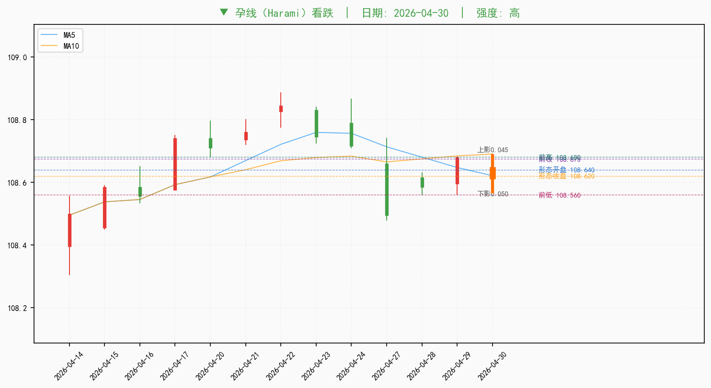
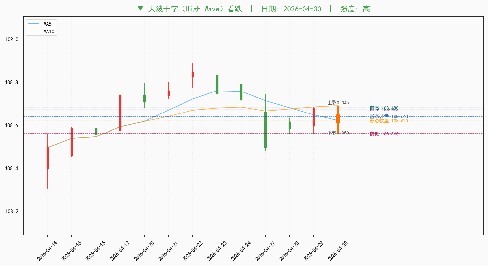
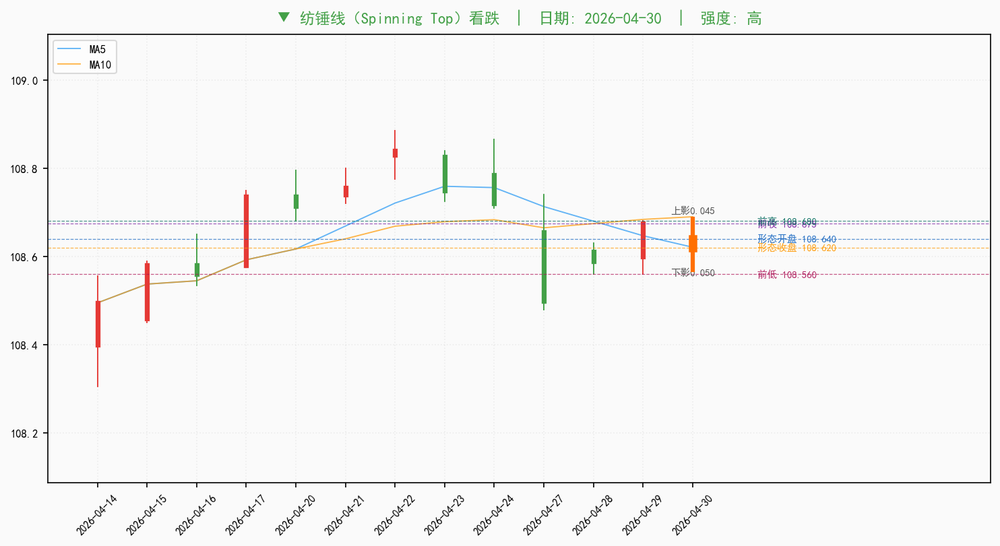

# 十年国债期货（T主力） (T0) 技术形态分析报告

**标的:** 十年国债期货（T主力）（T0） | **分析日期:** 2026-05-04  
**数据范围:** 2025-11-03 ~ 2026-04-30（120 交易日）

---

## 一、核心观点与交易提示

| 维度 | 结论 |
|------|------|
| 当前判断 | T0 短期处于震荡整理（ATR 6% 分位，波动收敛），趋势方向尚未形成明确突破 |
| 多空倾向 | 指标层面略偏谨慎，形态分歧，整体偏谨慎 |
| 关键点位 | 上方关注 108.621/108.921，下方关注 108.527/108.406/108.133 |
| 操作提示 | 短线宜偏防守，等待关键支撑确认；若放量站稳第一阻力再确认反弹 |

> 本表为研究结论，下方各章节给出推导依据。

---

## 二、技术面信号总览

| 维度 | 当前信号 | 方向判断 | 含义 |
|------|----------|---------|------|
| 趋势 | 1/3 短期均线多头，震荡整理 | **中性** | 趋势未明显走强，价格在均线区间反复 |
| 动量 | MACD 死叉、KDJ 死叉 | **偏空** | MACD/KDJ 同向死叉，短线动能转弱 |
| 超买超卖 | RSI(6)=50.0，RSI(12)=54.7 | **中性** | 尚未进入极端区间，无显著超买超卖情绪 |
| 波动率 | ATR(14) 处于 6% 分位 | **偏低** | 市场波动收敛，等待方向选择 |
| 成交量 | 量比 0.88x，25% 分位 | **偏弱** | 量能不足，方向确认乏力 |
| 形态 | 近30日 43 看涨 / 18 看跌 | **分歧** | 历史形态偏多，但最新一日转为看跌信号 |

> **统计**：偏多 0 / 偏空 2 / 分歧 1（共 6 维）。

---

## 三、价格快照与关键点位

### 3.1 行情数据

| 项目 | 数值 |
|------|------|
| 最新收盘价 | **108.620** |
| 日涨跌幅 | -0.05% |
| 最高价 | 108.685 |
| 最低价 | 108.570 |
| 开盘价 | 108.640 |
| 成交量 | 7.55万手 |
| MA5 | 108.621 |
| MA10 | 108.690 |
| MA20 | 108.527 |
| MA60 | 108.406 |
| **趋势判断** | **震荡整理**（1/3 均线多头） |

### 3.2 关键点位决策表

| 点位类型 | 点位 | 来源 | 使用含义 |
|---------|------|------|---------|
| 第一阻力 | 108.621 | MA5/MA10附近 | 短线反弹首先需要收复的位置 |
| 第二阻力 | 108.921 | BOLL上轨附近 | 若放量突破，趋势延续概率提高 |
| 第一支撑 | 108.527 | MA20/BOLL中轨附近 | 短线震荡中枢 |
| 第二支撑 | 108.406 | MA60附近 | 中期趋势防守位 |
| 下沿支撑 | 108.133 | BOLL下轨附近 | 若跌破，技术面转弱信号增强 |

> 阻力位为价格上方最近的 2 个均线/BOLL 参考；支撑位为下方最近的 3 个参考（含下沿支撑）。两点位价格相差小于 0.1% 时合并显示。

---

## 四、核心技术指标

| 指标 | 数值 | 历史分位（756日）| 状态 |
|------|------|------|--------|
| MACD | 0.0907 | - | MACD 死叉（看跌） |
| MACD Signal | 0.0931 | - | 柱体 < 0 |
| RSI(6) | 50.04 | 36% | 中性（36%分位） |
| RSI(12) | 54.69 | 46% | 中性（46%分位） |
| K | 43.39 | 24% | 偏低（24%分位） |
| D | 54.31 | 36% | 中性（36%分位） |
| J | 21.55 | 18% | 偏低（18%分位） |
| BOLL 上轨 | 108.921 | - | 布林带内 |
| BOLL 中轨 | 108.527 | - | - |
| BOLL 下轨 | 108.133 | - | - |
| ATR(14) | 0.1389 (0.13%) | 6% | 极端低位（6%分位） |
| 量比 | 0.88x | 25% | 偏低（25%分位） |
> 注：表中「历史分位」基于过去 756 个交易日的数据计算。

---

## 五、K 线形态识别

### 5.1 最新形态信号（最近 3 个交易日）

| 日期 | 主要形态 | 方向 | 解释 |
|------|----------|------|------|
| 2026-04-30 | 孕线/大波十字/纺锤线 | 偏空 | 看跌形态聚集，高位震荡后出现犹豫/转弱信号，需警惕方向选择 |
| 2026-04-29 | 三内部形态/收盘光头光脚 | 偏多 | 看涨形态聚集，短线企稳信号，但持续性需后续 K 线验证 |
| 2026-04-28 | 孕线/家鸽形态/短蜡烛线 | 混合 | 看涨与看跌形态并存，市场分歧明显，建议等待方向确认 |

**最新形态视觉化**（每张展示前后 12 根 K 线）：

### 5.2 近3日形态历史统计

> 以下为最近 3 个交易日识别到的形态在过去 3 年（756 日）的历史胜率、盈亏比与期望统计。出现次数为过去 3 年的样本量（不含最近 10 日），样本越少统计稳定性越低。

| 形态 | 方向 | 日期 | 出现次数 | 1日胜率 | 3日胜率 | 5日胜率 | 5日均盈 | 5日均亏 | 5日盈亏比 | 5日期望 |
|------|------|------|---------|--------|--------|--------|--------|--------|----------|--------|
| 🟢 孕线 | 看跌 | 2026-04-30 | 38 | 29% (11/38) | 37% (14/38) | 37% (14/38) | +0.21% | -0.28% | 0.74 | -0.101% |
| 🟢 大波十字 | 看跌 | 2026-04-30 | 32 | 47% (15/32) | 41% (13/32) | 31% (10/32) | +0.29% | -0.23% | 1.22 | -0.071% |
| 🟢 纺锤线 | 看跌 | 2026-04-30 | 72 | 40% (29/72) | 36% (26/72) | 33% (24/72) | +0.29% | -0.26% | 1.12 | -0.076% |
| 🔴 三内部形态 | 看涨 | 2026-04-29 | 13 | 54% (7/13) | 54% (7/13) | 62% (8/13) | +0.21% | -0.21% | 0.99 | +0.048% |
| 🔴 收盘光头光脚 | 看涨 | 2026-04-29 | 74 | 43% (32/74) | 55% (41/74) | 57% (42/74) | +0.22% | -0.30% | 0.72 | -0.007% |
| 🔴 孕线 | 看涨 | 2026-04-28 | 36 | 58% (21/36) | 72% (26/36) | 72% (26/36) | +0.22% | -0.28% | 0.78 | +0.080% |
| 🔴 家鸽形态 | 看涨 | 2026-04-28 | 9 | 44% (4/9) | 89% (8/9) | 56% (5/9) | +0.25% | -0.19% | 1.29 | +0.052% |
| 🟢 短蜡烛线 | 看跌 | 2026-04-28 | 41 | 37% (15/41) | 44% (18/41) | 49% (20/41) | +0.24% | -0.28% | 0.87 | -0.024% |

**形态统计分析提醒**

- 🟢 **孕线（看跌）**：历史胜率仅 37%，5日期望 -0.101%，过去3年方向预测价值有限，需结合其他指标验证。
- 🟢 **大波十字（看跌）**：历史胜率仅 31%，5日期望 -0.071%，过去3年方向预测价值有限，需结合其他指标验证。
- 🟢 **纺锤线（看跌）**：历史胜率仅 33%，5日期望 -0.076%，过去3年方向预测价值有限，需结合其他指标验证。
- 🔴 **三内部形态（看涨）**：历史胜率 62%，5日期望 +0.048%，过去3年方向预测价值相对稳定，与当前其他指标方向一致时参考意义较强。
- 🔴 **收盘光头光脚（看涨）**：历史胜率仅 57%，5日期望 -0.007%，过去3年方向预测价值有限，需结合其他指标验证。
- 🔴 **孕线（看涨）**：历史胜率 72%，5日期望 +0.080%，过去3年方向预测价值相对稳定，与当前其他指标方向一致时参考意义较强。
- 🔴 **家鸽形态（看涨）**：历史胜率 56%，5日期望 +0.052%，过去3年方向预测价值相对稳定，与当前其他指标方向一致时参考意义较强。
- 🟢 **短蜡烛线（看跌）**：历史胜率仅 49%，5日期望 -0.024%，过去3年方向预测价值有限，需结合其他指标验证。

> ⚠️ 历史胜率描述过去统计规律，不代表本次必然兑现；样本量 < 10 次时统计意义有限，需结合趋势、动量等多维度综合判断。

### 5.3 完整数据

*完整 61 项形态明细、形态详图与全部胜率统计见 **附录 A**。*

---

## 六、后市情景推演

| 情景 | 触发条件 | 含义 | 应对思路 |
|------|----------|------|----------|
| 上行情景 | 收盘站上 108.621，并接近/突破 108.921 | 短期均线压力解除，布林带上沿打开 | 可适度提高多头暴露，但需成交量配合 |
| 震荡情景 | 价格维持在 108.527 ~ 108.621 区间 | 均线与布林中轨附近反复拉锯 | 以区间交易和仓位控制为主 |
| 转弱情景 | 跌破 108.527，并接近 108.406 | 短期动能转弱，中期均线面临考验 | 降低追多意愿，关注止盈和回撤风险 |
| 破位情景 | 跌破 108.133 | 布林下轨失守，波动可能放大 | 技术面转为空头防守 |

> 情景推演基于章节三的关键点位生成，仅作为研究讨论框架，不构成交易建议。

---

## 七、辅助信号与异常提示

### 非核心指标异常信号

> 以下指标不在常规展示中，但因处于历史极端分位，自动纳入关注。

#### 高优先级信号（1 个）

| 指标 | 当前值 | 历史分位 | 状态 | 说明 |
|------|--------|---------|------|------|
| 累积/派发线(AD) | 4404994.2016 | 98% | 极端高位（98%分位） | 累积/派发线(AD) = 4404994.2016，处于历史98%分位 |

#### 中优先级信号（5 个）

| 指标 | 当前值 | 历史分位 | 状态 | 说明 |
|------|--------|---------|------|------|
| AD振荡器 | -37713.7341 | 5% | 极端低位（5%分位） | AD振荡器 = -37713.7341，处于历史5%分位 |
| 归一化ATR(14) | 0.1279 | 5% | 极端低位（5%分位） | 归一化ATR(14) = 0.13%，归一化波动率处于历史5%分位 |
| ATR(14) | 0.1389 | 6% | 极端低位（6%分位） | ATR(14) = 0.1389，处于历史6%分位 |
| 能量潮(OBV) | 4502511.0 | 91% | 极端高位（91%分位） | 能量潮(OBV) = 4502511.0000，处于历史91%分位 |
| ADXR(14) | 14.5235 | 9% | 极端低位（9%分位） | ADXR(14) = 14.5 |

### 同类指标共振检测

> 同类多个指标同时异常，信号置信度高于单一指标。

- **波动率（偏低共振）**：波动率：2 个指标同时处于历史低位（ATR(14)、归一化ATR(14)），动量超卖信号明确
- **成交量（偏高共振）**：成交量：2 个指标同时处于历史高位（能量潮(OBV)、累积/派发线(AD)），动量过热信号明确

> **指标冲突解读**：量比指标反映的是当日成交相对近期均值的活跃程度，而 累积/派发线(AD)、能量潮(OBV) 等指标更多反映量价资金流向或资金强弱位置。当前量比仅 25% 分位（偏弱），短线成交放量确认不足；但部分量价资金流指标已处于偏高分位（最高 98%），提示前期资金累积充分但当下追涨性价比有限。

---

## 八、使用边界

本报告主要用于辅助判断 **十年国债期货（T主力）** 短期技术状态，适用观察周期以 1—10 个交易日为主。由于国债期货价格与收益率方向相反，技术面信号应结合资金面、货币政策预期、现券收益率曲线、基差和跨期价差等因素综合使用。技术指标主要反映交易行为和市场情绪变化，不单独构成久期配置或方向交易依据。

---

## 九、风险声明

本报告仅供信息参考，不构成投资建议。请在做出交易决策前结合基本面分析、个人风险承受能力综合判断。

---

## 附录 A：形态明细与详图

### A.1 近 30 日完整形态明细（共 61 个）

| 形态（中文） | 形态（英文） | 日期 | 天前 | 方向 | 强度 | 收盘价 |
|-------------|-------------|------|------|------|------|--------|
| 🟢 孕线 | Harami | 2026-04-30 | 0d | 看跌 | 高 | 108.620 |
| 🟢 大波十字 | High Wave | 2026-04-30 | 0d | 看跌 | 高 | 108.620 |
| 🟢 纺锤线 | Spinning Top | 2026-04-30 | 0d | 看跌 | 高 | 108.620 |
| 🔴 三内部形态 | Three Inside | 2026-04-29 | 1d | 看涨 | 高 | 108.675 |
| 🔴 收盘光头光脚 | Closing Marubozu | 2026-04-29 | 1d | 看涨 | 高 | 108.675 |
| 🔴 孕线 | Harami | 2026-04-28 | 2d | 看涨 | 高 | 108.590 |
| 🔴 家鸽形态 | Homing Pigeon | 2026-04-28 | 2d | 看涨 | 高 | 108.590 |
| 🟢 短蜡烛线 | Short Line | 2026-04-28 | 2d | 看跌 | 高 | 108.590 |
| 🟢 收盘光头光脚 | Closing Marubozu | 2026-04-24 | 4d | 看跌 | 高 | 108.720 |
| 🟢 长蜡烛线 | Long Line | 2026-04-23 | 5d | 看跌 | 高 | 108.750 |
| 🔴 十字星 | Doji | 2026-04-22 | 6d | 看涨 | 高 | 108.840 |
| 🔴 大波十字 | High Wave | 2026-04-22 | 6d | 看涨 | 高 | 108.840 |
| 🔴 长脚十字 | Long Legged Doji | 2026-04-22 | 6d | 看涨 | 高 | 108.840 |
| 🔴 黄包车夫 | Rickshaw Man | 2026-04-22 | 6d | 看涨 | 高 | 108.840 |
| 🔴 纺锤线 | Spinning Top | 2026-04-22 | 6d | 看涨 | 高 | 108.840 |
| 🔴 纺锤线 | Spinning Top | 2026-04-21 | 7d | 看涨 | 高 | 108.755 |
| 🟢 孕线 | Harami | 2026-04-20 | 8d | 看跌 | 中 | 108.715 |
| 🟢 纺锤线 | Spinning Top | 2026-04-20 | 8d | 看跌 | 高 | 108.715 |
| 🔴 捉腰带线 | Belt Hold | 2026-04-17 | 9d | 看涨 | 高 | 108.735 |
| 🔴 长蜡烛线 | Long Line | 2026-04-17 | 9d | 看涨 | 高 | 108.735 |
| 🔴 分离线 | Separating Lines | 2026-04-17 | 9d | 看涨 | 高 | 108.735 |
| 🟢 孕线 | Harami | 2026-04-16 | 10d | 看跌 | 中 | 108.560 |
| 🟢 纺锤线 | Spinning Top | 2026-04-16 | 10d | 看跌 | 高 | 108.560 |
| 🔴 捉腰带线 | Belt Hold | 2026-04-15 | 11d | 看涨 | 高 | 108.580 |
| 🔴 收盘光头光脚 | Closing Marubozu | 2026-04-15 | 11d | 看涨 | 高 | 108.580 |
| 🔴 长蜡烛线 | Long Line | 2026-04-15 | 11d | 看涨 | 高 | 108.580 |
| 🔴 光头光脚 | Marubozu | 2026-04-15 | 11d | 看涨 | 高 | 108.580 |
| 🟢 乌云盖顶 | Dark Cloud Cover | 2026-04-09 | 15d | 看跌 | 高 | 108.290 |
| 🔴 收盘光头光脚 | Closing Marubozu | 2026-04-08 | 16d | 看涨 | 高 | 108.325 |
| 🔴 长蜡烛线 | Long Line | 2026-04-08 | 16d | 看涨 | 高 | 108.325 |
| 🔴 十字星 | Doji | 2026-04-07 | 17d | 看涨 | 高 | 108.295 |
| 🔴 大波十字 | High Wave | 2026-04-07 | 17d | 看涨 | 高 | 108.295 |
| 🔴 长脚十字 | Long Legged Doji | 2026-04-07 | 17d | 看涨 | 高 | 108.295 |
| 🔴 黄包车夫 | Rickshaw Man | 2026-04-07 | 17d | 看涨 | 高 | 108.295 |
| 🔴 纺锤线 | Spinning Top | 2026-04-07 | 17d | 看涨 | 高 | 108.295 |
| 🟢 陷阱形态 | Hikkake | 2026-04-02 | 19d | 看跌 | 高 | 108.200 |
| 🟢 收盘光头光脚 | Closing Marubozu | 2026-04-01 | 20d | 看跌 | 高 | 108.210 |
| 🔴 纺锤线 | Spinning Top | 2026-03-31 | 21d | 看涨 | 高 | 108.400 |
| 🔴 收盘光头光脚 | Closing Marubozu | 2026-03-30 | 22d | 看涨 | 高 | 108.390 |
| 🟢 陷阱形态 | Hikkake | 2026-03-30 | 22d | 看跌 | 高 | 108.390 |
| 🔴 长蜡烛线 | Long Line | 2026-03-30 | 22d | 看涨 | 高 | 108.390 |
| 🔴 十字星 | Doji | 2026-03-27 | 23d | 看涨 | 高 | 108.235 |
| 🔴 大波十字 | High Wave | 2026-03-27 | 23d | 看涨 | 高 | 108.235 |
| 🔴 长脚十字 | Long Legged Doji | 2026-03-27 | 23d | 看涨 | 高 | 108.235 |
| 🔴 黄包车夫 | Rickshaw Man | 2026-03-27 | 23d | 看涨 | 高 | 108.235 |
| 🔴 纺锤线 | Spinning Top | 2026-03-27 | 23d | 看涨 | 高 | 108.235 |
| 🔴 十字星 | Doji | 2026-03-25 | 25d | 看涨 | 高 | 108.155 |
| 🔴 墓碑十字 | Gravestone Doji | 2026-03-25 | 25d | 看涨 | 高 | 108.155 |
| 🟢 陷阱形态 | Hikkake | 2026-03-25 | 25d | 看跌 | 高 | 108.155 |
| 🔴 倒锤线 | Inverted Hammer | 2026-03-25 | 25d | 看涨 | 高 | 108.155 |
| 🔴 长脚十字 | Long Legged Doji | 2026-03-25 | 25d | 看涨 | 高 | 108.155 |
| 🔴 孕线 | Harami | 2026-03-24 | 26d | 看涨 | 高 | 108.165 |
| 🔴 家鸽形态 | Homing Pigeon | 2026-03-24 | 26d | 看涨 | 高 | 108.165 |
| 🟢 三内部形态 | Three Inside | 2026-03-23 | 27d | 看跌 | 高 | 108.145 |
| 🔴 陷阱形态 | Hikkake | 2026-03-23 | 27d | 看涨 | 高 | 108.145 |
| 🟢 孕线 | Harami | 2026-03-20 | 28d | 看跌 | 高 | 108.255 |
| 🔴 捉腰带线 | Belt Hold | 2026-03-18 | 30d | 看涨 | 高 | 108.265 |
| 🔴 收盘光头光脚 | Closing Marubozu | 2026-03-18 | 30d | 看涨 | 高 | 108.265 |
| 🟢 陷阱形态 | Hikkake | 2026-03-18 | 30d | 看跌 | 高 | 108.265 |
| 🔴 长蜡烛线 | Long Line | 2026-03-18 | 30d | 看涨 | 高 | 108.265 |
| 🔴 光头光脚 | Marubozu | 2026-03-18 | 30d | 看涨 | 高 | 108.265 |

### A.2 历史形态汇总

| 方向 | 数量 |
|------|------|
| 🔴 看涨形态 | 160 |
| 🟢 看跌形态 | 77 |

**30 日汇总：** 43 个看涨形态 vs 18 个看跌形态

### A.3 形态过去 3 年胜率统计（完整版）

> **胜率定义**：形态出现后第 N 个交易日收盘价方向与形态预测方向一致的比例。
> - 看涨形态成功 = N 日后收盘价 > 形态当日收盘价
> - 看跌形态成功 = N 日后收盘价 < 形态当日收盘价
>
> **盈亏比与期望**（基于 5 日观察期，按"形态视角收益"统计：看涨形态收益用原始涨跌幅，看跌形态取反，正值即方向预测兑现）：
> - **5日均盈**：胜的样本的形态视角收益均值（≥0）
> - **5日均亏**：败的样本的形态视角收益均值（≤0）
> - **5日盈亏比** = 5日均盈 / |5日均亏|，> 1 表示赢得比输得多
> - **5日期望** = 胜率 × 均盈 + (1-胜率) × 均亏，正值表示该形态过去 3 年综合期望为正
>
> **样本窗口**：过去 756 个交易日（已扣除最后 10 日，以保证每个样本都有 10 日观察期）。
> **样本要求**：仅展示过去 3 年内出现 ≥ 3 次的形态-方向组合。

| 形态（中文） | 形态（英文） | 方向 | 出现次数 | 1日胜率 | 3日胜率 | 5日胜率 | 10日胜率 | 5日均盈 | 5日均亏 | 5日盈亏比 | 5日期望 |
|-------------|-------------|------|---------|--------|--------|--------|---------|--------|--------|----------|--------|
| 🔴 十字星 | Doji | 看涨 | 104 | 57% (59/104) | 62% (64/104) | 67% (70/104) | 60% (62/104) | +0.27% | -0.25% | 1.08 | +0.100% |
| 🔴 长脚十字 | Long Legged Doji | 看涨 | 104 | 57% (59/104) | 62% (64/104) | 67% (70/104) | 60% (62/104) | +0.27% | -0.25% | 1.08 | +0.100% |
| 🔴 长蜡烛线 | Long Line | 看涨 | 96 | 49% (47/96) | 57% (55/96) | 60% (58/96) | 60% (58/96) | +0.21% | -0.24% | 0.84 | +0.028% |
| 🔴 纺锤线 | Spinning Top | 看涨 | 96 | 54% (52/96) | 58% (56/96) | 59% (57/96) | 61% (59/96) | +0.26% | -0.23% | 1.13 | +0.062% |
| 🔴 收盘光头光脚 | Closing Marubozu | 看涨 | 74 | 43% (32/74) | 55% (41/74) | 57% (42/74) | 59% (44/74) | +0.22% | -0.30% | 0.72 | -0.007% |
| 🟢 长蜡烛线 | Long Line | 看跌 | 74 | 42% (31/74) | 36% (27/74) | 32% (24/74) | 38% (28/74) | +0.19% | -0.25% | 0.76 | -0.106% |
| 🟢 纺锤线 | Spinning Top | 看跌 | 72 | 40% (29/72) | 36% (26/72) | 33% (24/72) | 42% (30/72) | +0.29% | -0.26% | 1.12 | -0.076% |
| 🔴 黄包车夫 | Rickshaw Man | 看涨 | 69 | 58% (40/69) | 61% (42/69) | 65% (45/69) | 61% (42/69) | +0.24% | -0.23% | 1.06 | +0.079% |
| 🔴 大波十字 | High Wave | 看涨 | 64 | 62% (40/64) | 62% (40/64) | 67% (43/64) | 64% (41/64) | +0.26% | -0.23% | 1.13 | +0.098% |
| 🟢 陷阱形态 | Hikkake | 看跌 | 59 | 39% (23/59) | 42% (25/59) | 44% (26/59) | 41% (24/59) | +0.27% | -0.25% | 1.07 | -0.022% |
| 🔴 捉腰带线 | Belt Hold | 看涨 | 57 | 56% (32/57) | 65% (37/57) | 70% (40/57) | 61% (35/57) | +0.20% | -0.27% | 0.75 | +0.061% |
| 🟢 捉腰带线 | Belt Hold | 看跌 | 48 | 40% (19/48) | 46% (22/48) | 40% (19/48) | 35% (17/48) | +0.28% | -0.25% | 1.10 | -0.043% |
| 🔴 短蜡烛线 | Short Line | 看涨 | 45 | 49% (22/45) | 56% (25/45) | 53% (24/45) | 67% (30/45) | +0.25% | -0.24% | 1.04 | +0.021% |
| 🟢 收盘光头光脚 | Closing Marubozu | 看跌 | 43 | 35% (15/43) | 28% (12/43) | 26% (11/43) | 28% (12/43) | +0.19% | -0.24% | 0.80 | -0.127% |
| 🟢 短蜡烛线 | Short Line | 看跌 | 41 | 37% (15/41) | 44% (18/41) | 49% (20/41) | 44% (18/41) | +0.24% | -0.28% | 0.87 | -0.024% |
| 🟢 孕线 | Harami | 看跌 | 38 | 29% (11/38) | 37% (14/38) | 37% (14/38) | 21% (8/38) | +0.21% | -0.28% | 0.74 | -0.101% |
| 🔴 吞没形态 | Engulfing | 看涨 | 37 | 54% (20/37) | 57% (21/37) | 54% (20/37) | 73% (27/37) | +0.22% | -0.15% | 1.46 | +0.049% |
| 🔴 孕线 | Harami | 看涨 | 36 | 58% (21/36) | 72% (26/36) | 72% (26/36) | 58% (21/36) | +0.22% | -0.28% | 0.78 | +0.080% |
| 🟢 吞没形态 | Engulfing | 看跌 | 32 | 34% (11/32) | 34% (11/32) | 31% (10/32) | 41% (13/32) | +0.36% | -0.27% | 1.33 | -0.075% |
| 🟢 大波十字 | High Wave | 看跌 | 32 | 47% (15/32) | 41% (13/32) | 31% (10/32) | 47% (15/32) | +0.29% | -0.23% | 1.22 | -0.071% |
| 🔴 陷阱形态 | Hikkake | 看涨 | 25 | 48% (12/25) | 56% (14/25) | 68% (17/25) | 64% (16/25) | +0.24% | -0.23% | 1.06 | +0.092% |
| 🔴 光头光脚 | Marubozu | 看涨 | 25 | 40% (10/25) | 56% (14/25) | 64% (16/25) | 68% (17/25) | +0.25% | -0.22% | 1.11 | +0.078% |
| 🔴 三外部形态 | Three Outside | 看涨 | 18 | 56% (10/18) | 61% (11/18) | 50% (9/18) | 67% (12/18) | +0.24% | -0.14% | 1.74 | +0.050% |
| 🔴 三内部形态 | Three Inside | 看涨 | 13 | 54% (7/13) | 54% (7/13) | 62% (8/13) | 46% (6/13) | +0.21% | -0.21% | 0.99 | +0.048% |
| 🟢 光头光脚 | Marubozu | 看跌 | 13 | 31% (4/13) | 23% (3/13) | 31% (4/13) | 31% (4/13) | +0.12% | -0.17% | 0.69 | -0.080% |
| 🔴 锤子线 | Hammer | 看涨 | 12 | 58% (7/12) | 75% (9/12) | 75% (9/12) | 75% (9/12) | +0.17% | -0.31% | 0.55 | +0.051% |
| 🟢 上吊线 | Hanging Man | 看跌 | 12 | 58% (7/12) | 50% (6/12) | 58% (7/12) | 67% (8/12) | +0.22% | -0.22% | 1.00 | +0.036% |
| 🟢 十字孕线 | Harami Cross | 看跌 | 12 | 25% (3/12) | 42% (5/12) | 25% (3/12) | 17% (2/12) | +0.30% | -0.32% | 0.95 | -0.162% |
| 🟢 射击之星 | Shooting Star | 看跌 | 12 | 25% (3/12) | 17% (2/12) | 25% (3/12) | 25% (3/12) | +0.38% | -0.28% | 1.34 | -0.117% |
| 🔴 十字孕线 | Harami Cross | 看涨 | 11 | 55% (6/11) | 73% (8/11) | 73% (8/11) | 45% (5/11) | +0.16% | -0.35% | 0.45 | +0.020% |
| 🔴 蜻蜓十字 | Dragonfly Doji | 看涨 | 9 | 33% (3/9) | 33% (3/9) | 22% (2/9) | 22% (2/9) | +0.41% | -0.36% | 1.14 | -0.189% |
| 🔴 家鸽形态 | Homing Pigeon | 看涨 | 9 | 44% (4/9) | 89% (8/9) | 56% (5/9) | 56% (5/9) | +0.25% | -0.19% | 1.29 | +0.052% |
| 🔴 探水竿 | Takuri | 看涨 | 9 | 33% (3/9) | 33% (3/9) | 22% (2/9) | 22% (2/9) | +0.41% | -0.36% | 1.14 | -0.189% |
| 🟢 插入线 | Thrusting Pattern | 看跌 | 9 | 67% (6/9) | 33% (3/9) | 33% (3/9) | 22% (2/9) | +0.23% | -0.21% | 1.09 | -0.063% |
| 🟢 三外部形态 | Three Outside | 看跌 | 8 | 50% (4/8) | 25% (2/8) | 25% (2/8) | 38% (3/8) | +0.25% | -0.21% | 1.20 | -0.093% |
| 🟢 十字星形态 | Doji Star | 看跌 | 8 | 62% (5/8) | 38% (3/8) | 50% (4/8) | 50% (4/8) | +0.18% | -0.24% | 0.74 | -0.031% |
| 🔴 墓碑十字 | Gravestone Doji | 看涨 | 7 | 86% (6/7) | 71% (5/7) | 71% (5/7) | 71% (5/7) | +0.28% | -0.53% | 0.52 | +0.045% |
| 🔴 十字星形态 | Doji Star | 看涨 | 6 | 50% (3/6) | 33% (2/6) | 33% (2/6) | 33% (2/6) | +0.31% | -0.21% | 1.50 | -0.035% |
| 🔴 匹配低形态 | Matching Low | 看涨 | 6 | 67% (4/6) | 83% (5/6) | 50% (3/6) | 17% (1/6) | +0.15% | -0.09% | 1.67 | +0.030% |
| 🟢 三内部形态 | Three Inside | 看跌 | 4 | 25% (1/4) | 50% (2/4) | 25% (1/4) | 0% (0/4) | +0.14% | -0.21% | 0.69 | -0.121% |
| 🟢 乌云盖顶 | Dark Cloud Cover | 看跌 | 4 | 50% (2/4) | 25% (1/4) | 25% (1/4) | 0% (0/4) | +0.15% | -0.32% | 0.46 | -0.205% |
| 🟢 黄昏之星 | Evening Star | 看跌 | 3 | 67% (2/3) | 33% (1/3) | 100% (3/3) | 67% (2/3) | +0.18% | - | - | +0.177% |

*共统计 42 个形态-方向组合（出现 ≥ 3 次）。胜率 > 50% + 盈亏比 > 1 + 5日期望 > 0 三者同时满足，方可视为该形态在过去 3 年具备方向预测价值。单一指标不构成交易决策依据，需结合样本量和市场环境综合判断。*

---

*报告生成时间: 2026-05-04 19:43:20*  
*数据来源: AKShare / 腾讯财经 / Tushare / BaoStock（多源自动切换）*