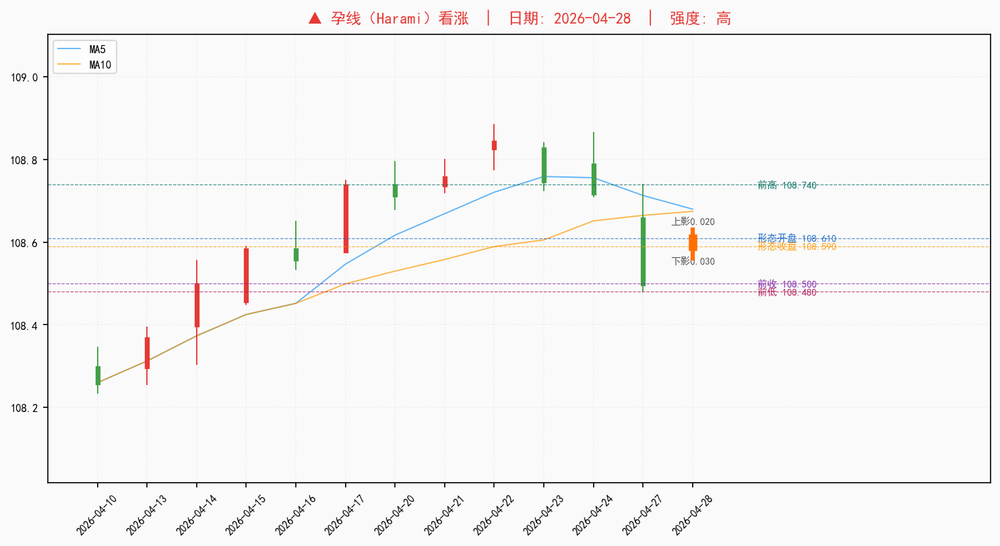
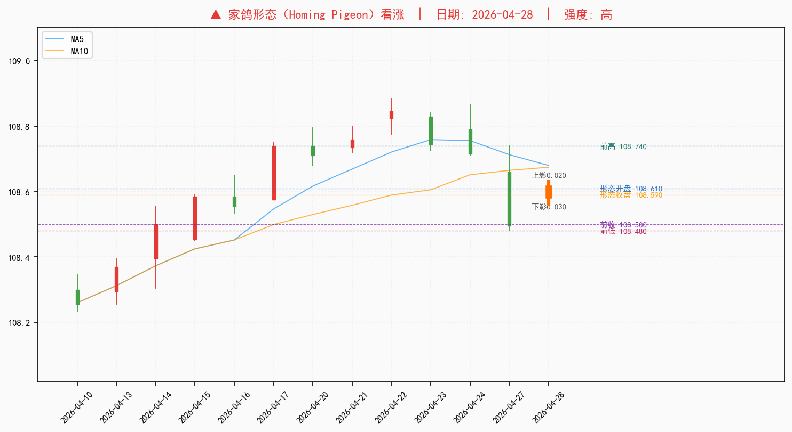
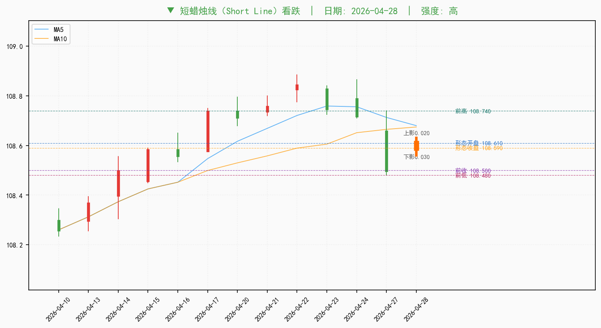

# 十年国债期货（T主力） (T0) 技术形态分析报告

**标的:** 十年国债期货（T主力）（T0） | **分析日期:** 2026-04-29  
**数据范围:** 2025-10-30 ~ 2026-04-28（120 交易日）

---

## 一、价格快照

| 项目 | 数值 |
|------|------|
| 最新收盘价 | **108.590** |
| 日涨跌幅 | +0.08% |
| 最高价 | 108.630 |
| 最低价 | 108.560 |
| 开盘价 | 108.610 |
| 成交量 | 8.81万手 |
| MA5 | 108.680 |
| MA10 | 108.675 |
| MA20 | 108.493 |
| MA60 | 108.391 |
| **趋势判断** | **震荡整理**（1/3 均线多头） |

---

## 二、核心技术指标

| 指标 | 数值 | 历史分位（252日）| 状态 |
|------|------|------|--------|
| MACD | 0.0986 | - | MACD 金叉（看涨） |
| MACD Signal | 0.0928 | - | 柱体 > 0 |
| RSI(6) | 47.98 | 43% | 中性（43%分位） |
| RSI(12) | 54.05 | 60% | 中性（60%分位） |
| K | 47.62 | 42% | 中性（42%分位） |
| D | 65.75 | 71% | 偏高（71%分位） |
| J | 11.36 | 16% | 偏低（16%分位） |
| BOLL 上轨 | 108.903 | - | 布林带内 |
| BOLL 中轨 | 108.493 | - | - |
| BOLL 下轨 | 108.083 | - | - |
| ATR(14) | 0.1423 (0.13%) | 22% | 偏低（22%分位） |
| 量比 | 0.99x | 55% | 中性（55%分位） |

---

## 三、TA-Lib 形态识别

### 近30日形态（63 个）

| 形态（中文） | 形态（英文） | 日期 | 天前 | 方向 | 强度 | 收盘价 |
|-------------|-------------|------|------|------|------|--------|
| 🟢 孕线 | Harami | 2026-04-28 | 0d | 看涨 | 高 | 108.590 |
| 🟢 家鸽形态 | Homing Pigeon | 2026-04-28 | 0d | 看涨 | 高 | 108.590 |
| 🔴 短蜡烛线 | Short Line | 2026-04-28 | 0d | 看跌 | 高 | 108.590 |
| 🔴 收盘光头光脚 | Closing Marubozu | 2026-04-24 | 2d | 看跌 | 高 | 108.720 |
| 🔴 长蜡烛线 | Long Line | 2026-04-23 | 3d | 看跌 | 高 | 108.750 |
| 🟢 十字星 | Doji | 2026-04-22 | 4d | 看涨 | 高 | 108.840 |
| 🟢 大波十字 | High Wave | 2026-04-22 | 4d | 看涨 | 高 | 108.840 |
| 🟢 长脚十字 | Long Legged Doji | 2026-04-22 | 4d | 看涨 | 高 | 108.840 |
| 🟢 黄包车夫 | Rickshaw Man | 2026-04-22 | 4d | 看涨 | 高 | 108.840 |
| 🟢 纺锤线 | Spinning Top | 2026-04-22 | 4d | 看涨 | 高 | 108.840 |
| 🟢 纺锤线 | Spinning Top | 2026-04-21 | 5d | 看涨 | 高 | 108.755 |
| 🔴 孕线 | Harami | 2026-04-20 | 6d | 看跌 | 中 | 108.715 |
| 🔴 纺锤线 | Spinning Top | 2026-04-20 | 6d | 看跌 | 高 | 108.715 |
| 🟢 捉腰带线 | Belt Hold | 2026-04-17 | 7d | 看涨 | 高 | 108.735 |
| 🟢 长蜡烛线 | Long Line | 2026-04-17 | 7d | 看涨 | 高 | 108.735 |
| 🟢 分离线 | Separating Lines | 2026-04-17 | 7d | 看涨 | 高 | 108.735 |
| 🔴 孕线 | Harami | 2026-04-16 | 8d | 看跌 | 中 | 108.560 |
| 🔴 纺锤线 | Spinning Top | 2026-04-16 | 8d | 看跌 | 高 | 108.560 |
| 🟢 捉腰带线 | Belt Hold | 2026-04-15 | 9d | 看涨 | 高 | 108.580 |
| 🟢 收盘光头光脚 | Closing Marubozu | 2026-04-15 | 9d | 看涨 | 高 | 108.580 |
| 🟢 长蜡烛线 | Long Line | 2026-04-15 | 9d | 看涨 | 高 | 108.580 |
| 🟢 光头光脚 | Marubozu | 2026-04-15 | 9d | 看涨 | 高 | 108.580 |
| 🔴 乌云盖顶 | Dark Cloud Cover | 2026-04-09 | 13d | 看跌 | 高 | 108.290 |
| 🟢 收盘光头光脚 | Closing Marubozu | 2026-04-08 | 14d | 看涨 | 高 | 108.325 |
| 🟢 长蜡烛线 | Long Line | 2026-04-08 | 14d | 看涨 | 高 | 108.325 |
| 🟢 十字星 | Doji | 2026-04-07 | 15d | 看涨 | 高 | 108.295 |
| 🟢 大波十字 | High Wave | 2026-04-07 | 15d | 看涨 | 高 | 108.295 |
| 🟢 长脚十字 | Long Legged Doji | 2026-04-07 | 15d | 看涨 | 高 | 108.295 |
| 🟢 黄包车夫 | Rickshaw Man | 2026-04-07 | 15d | 看涨 | 高 | 108.295 |
| 🟢 纺锤线 | Spinning Top | 2026-04-07 | 15d | 看涨 | 高 | 108.295 |
| 🔴 陷阱形态 | Hikkake | 2026-04-02 | 17d | 看跌 | 高 | 108.200 |
| 🔴 收盘光头光脚 | Closing Marubozu | 2026-04-01 | 18d | 看跌 | 高 | 108.210 |
| 🟢 纺锤线 | Spinning Top | 2026-03-31 | 19d | 看涨 | 高 | 108.400 |
| 🟢 收盘光头光脚 | Closing Marubozu | 2026-03-30 | 20d | 看涨 | 高 | 108.390 |
| 🔴 陷阱形态 | Hikkake | 2026-03-30 | 20d | 看跌 | 高 | 108.390 |
| 🟢 长蜡烛线 | Long Line | 2026-03-30 | 20d | 看涨 | 高 | 108.390 |
| 🟢 十字星 | Doji | 2026-03-27 | 21d | 看涨 | 高 | 108.235 |
| 🟢 大波十字 | High Wave | 2026-03-27 | 21d | 看涨 | 高 | 108.235 |
| 🟢 长脚十字 | Long Legged Doji | 2026-03-27 | 21d | 看涨 | 高 | 108.235 |
| 🟢 黄包车夫 | Rickshaw Man | 2026-03-27 | 21d | 看涨 | 高 | 108.235 |
| 🟢 纺锤线 | Spinning Top | 2026-03-27 | 21d | 看涨 | 高 | 108.235 |
| 🟢 十字星 | Doji | 2026-03-25 | 23d | 看涨 | 高 | 108.155 |
| 🟢 墓碑十字 | Gravestone Doji | 2026-03-25 | 23d | 看涨 | 高 | 108.155 |
| 🔴 陷阱形态 | Hikkake | 2026-03-25 | 23d | 看跌 | 高 | 108.155 |
| 🟢 倒锤线 | Inverted Hammer | 2026-03-25 | 23d | 看涨 | 高 | 108.155 |
| 🟢 长脚十字 | Long Legged Doji | 2026-03-25 | 23d | 看涨 | 高 | 108.155 |
| 🟢 孕线 | Harami | 2026-03-24 | 24d | 看涨 | 高 | 108.165 |
| 🟢 家鸽形态 | Homing Pigeon | 2026-03-24 | 24d | 看涨 | 高 | 108.165 |
| 🔴 三内部形态 | Three Inside | 2026-03-23 | 25d | 看跌 | 高 | 108.145 |
| 🟢 陷阱形态 | Hikkake | 2026-03-23 | 25d | 看涨 | 高 | 108.145 |
| 🔴 孕线 | Harami | 2026-03-20 | 26d | 看跌 | 高 | 108.255 |
| 🟢 捉腰带线 | Belt Hold | 2026-03-18 | 28d | 看涨 | 高 | 108.265 |
| 🟢 收盘光头光脚 | Closing Marubozu | 2026-03-18 | 28d | 看涨 | 高 | 108.265 |
| 🔴 陷阱形态 | Hikkake | 2026-03-18 | 28d | 看跌 | 高 | 108.265 |
| 🟢 长蜡烛线 | Long Line | 2026-03-18 | 28d | 看涨 | 高 | 108.265 |
| 🟢 光头光脚 | Marubozu | 2026-03-18 | 28d | 看涨 | 高 | 108.265 |
| 🟢 十字星 | Doji | 2026-03-17 | 29d | 看涨 | 高 | 108.140 |
| 🟢 大波十字 | High Wave | 2026-03-17 | 29d | 看涨 | 高 | 108.140 |
| 🟢 长脚十字 | Long Legged Doji | 2026-03-17 | 29d | 看涨 | 高 | 108.140 |
| 🟢 黄包车夫 | Rickshaw Man | 2026-03-17 | 29d | 看涨 | 高 | 108.140 |
| 🟢 纺锤线 | Spinning Top | 2026-03-17 | 29d | 看涨 | 高 | 108.140 |
| 🟢 锤子线 | Hammer | 2026-03-16 | 30d | 看涨 | 高 | 108.120 |
| 🟢 陷阱形态 | Hikkake | 2026-03-16 | 30d | 看涨 | 高 | 108.120 |

### 形态详图

*以下为近30日内各形态的放大详图（每张展示前后12根K线）：*

### 历史形态统计

| 方向 | 数量 |
|------|------|
| 🟢 看涨形态 | 160 |
| 🔴 看跌形态 | 78 |

**30日汇总：** 48 个看涨形态 vs 15 个看跌形态

---

## 四、扩展信号扫描

### 非核心指标异常信号

> 以下指标不在常规展示中，但因处于历史极端分位，自动纳入关注。

#### 高优先级信号（1 个）

| 指标 | 当前值 | 历史分位 | 状态 | 说明 |
|------|--------|---------|------|------|
| AD振荡器 | -64549.1001 | 1% | 极端低位（1%分位） | AD振荡器 = -64549.1001，处于历史1%分位 |

#### 中优先级信号（5 个）

| 指标 | 当前值 | 历史分位 | 状态 | 说明 |
|------|--------|---------|------|------|
| 终极振荡器 | 39.4048 | 6% | 极端低位（6%分位） | 终极振荡器 = 39.4048，处于历史6%分位 |
| 累积/派发线(AD) | 649528.201 | 93% | 极端高位（93%分位） | 累积/派发线(AD) = 649528.2010，处于历史93%分位 |
| APO(12) | 0.2034 | 91% | 极端高位（91%分位） | APO(12) = 0.2034，处于历史91%分位 |
| PPO(12) | 0.1876 | 91% | 极端高位（91%分位） | PPO(12) = 0.1876，处于历史91%分位 |
| 能量潮(OBV) | 144721.0 | 90% | 极端高位（90%分位） | 能量潮(OBV) = 144721.0000，处于历史90%分位 |

### 同类指标共振检测

> 同类多个指标同时异常，信号置信度高于单一指标。

- **成交量（偏高共振）**：成交量：2 个指标同时处于历史高位（能量潮(OBV)、累积/派发线(AD)），动量过热信号明确

---

## 五、技术面概览

- 均线系统：震荡整理（1/3 短期均线多头）
- MACD 金叉：DIF=0.0986，信号线=0.0928
- RSI(6)=48.0，中性区间
- KDJ 死叉：K=47.6 D=65.8
- 布林带：布林带内，ATR日波动率 0.13%
- 近30日形态：48 看涨 / 15 看跌

**ATR(14) 波动参考：** 0.1423（日波动率 0.13%）

---

## 六、风险声明

本报告仅供信息参考，不构成投资建议。请在做出交易决策前结合基本面分析、个人风险承受能力综合判断。

---

*报告生成时间: 2026-04-29 13:15:48*  
*数据来源: AKShare / 腾讯财经 / Tushare / BaoStock（多源自动切换）*
